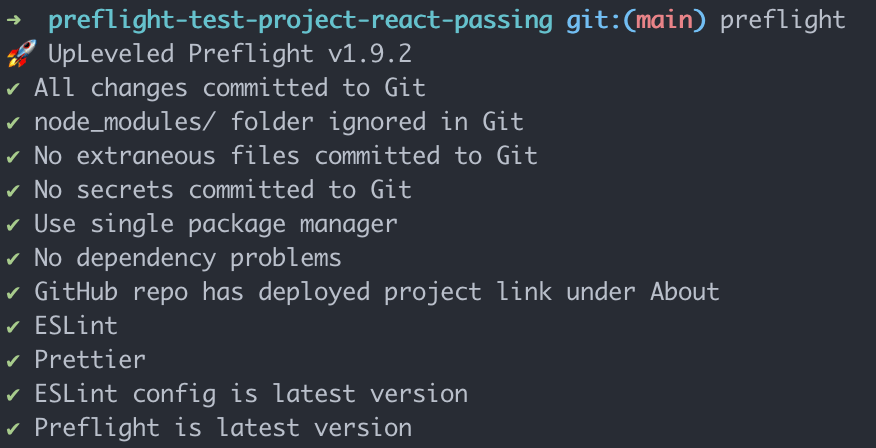

# UpLeveled Preflight

A command line tool to check your UpLeveled projects before you submit



## Install

```bash
yarn global add @upleveled/preflight
```

## Run

```bash
preflight
```

## Install and Run with Docker

```bash
# Pull the image
docker pull ghcr.io/upleveled/preflight

# Run the image against a GitHub repo URL
docker run ghcr.io/upleveled/preflight https://github.com/upleveled/preflight-test-project-react-passing

# Or run the image against a specific branch in a GitHub repo URL
docker run ghcr.io/upleveled/preflight https://github.com/upleveled/preflight-test-project-react-passing fix-tests
```
